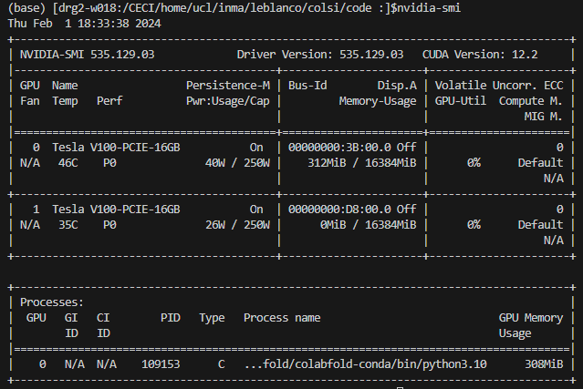

# cluster_examples

## Setup the environment

```
conda env create -f dependencies.yml 
```
If the conda command is not recognized, read [CONDA_INSTALL.md](CONDA_INSTALL.md).

To activate this environment, use
```
conda activate colsi-env / source activate colsi-env
```
To deactivate an active environment, use
```
conda deactivate / source deactivate
```
where ``source`` might be needed for recent versions of conda.

---
If you want another environment name, write
```
conda env create -f dependencies.yml --name <your_env_name>
```


Request a GPU with
```
srun --partition=gpu --time="0:20:00" --gres="gpu:TeslaA100:1" --cpus-per-task=5 --mem-per-gpu=16G --nodes=1 --ntasks-per-node=1 -J pbtrack --pty zsh -l
```

## Check GPU access

double check you are correctly on the node with

```
hostname
```

you should read something like ``mb-mil110.cism.ucl.ac.be`` on *Manneback* or ``drg2-w018`` on *Dragon2*. <br>
Another way to verify this consists in checking a GPU is available on your node:
```
  nvidia-smi
```

<p align="center">

</p> 